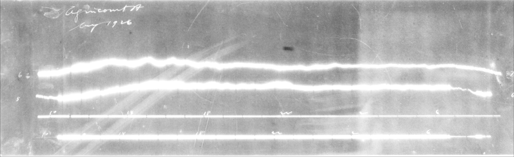

```{r setup, include = FALSE}
knitr::opts_chunk$set(
  collapse = TRUE,
  comment = "#>"
)
```


```{r lib, message = FALSE}
library(magneto)
library(rtiff)
library(tiff)
rawTiff <- "AGC-D-19040830-19040901.tif"
```


This package is intended to be used on scanned images in .tif or .tiff format.  Other formats can be used if another image importing function is created by the user.  The functions shown below are meant to be building blocks for digitization of many types of images plotted against time.  TIS (Trace Identification through Separation) and TISI (Trace Identification through Separation Improvement) are intended, in the default state, to be only used for magnetogram images;  that being said, all parameters can be altered for use in other applications.  It is recommended to find parameters for TIS and TISI by using the other mentioned functions below.


## Worked example with a magnetogram, following the process used by TIS and TISI

Both TIS and TISI use 10 main functions to do the image processing. Note: all functions mentioned are available from the NAMESPACE for use by anyone.

### import_process_image()

Used to change orientation of an image, as well processes the image into a matrix of pixels.  These pixels are all 0 (black) or 1 (white).  The pixels being 0 or 1 is very important for the rest of the digitization process!

- **Required**
  - imageName	
    - The name of the file.
  
  - file_loc	
    - The path from ~/ (home) to the dir where the file is.
    
- **Optional**
  - trimAmountTop, 	Default = 100
    - Number of pixels off of top of image (usually for common flares).
  
  - trimAmountBottom, Default = 50
    - Number of pixels off of bottom of image.

  - beta0, Default = -2.774327 	
    - The intercept of a logistic regression default is for magnetograms.
  
  - beta1, Default = 51.91687
    - The slope of the logistic regression default is for magnetograms.
  
  - cutoffProbability, Default = 0.5	
    - The probability cut off for the decision of an imageMatrix being bright.

  - NADefault, Default = 0
    - The default value set to NA's found in the matrix.
  
  - FilterBright, Default = c(13, 13)	
    - Vector specifying the dimensions of the kernel, which will be used to perform either delation or erosion, such as c(13,13).
  
  - FilterNonBright	, Default = c(8,8)
    - Vector specifying the dimensions of the kernel, which will be used to perform either delation or erosion, such as c(8,8).
  
  - methodBright, Default = "delation"	
    - One of 'delation'(adds to image, making brights brighter), 'erosion' (subtracts from image brights darker). See OpenImageR for description.

  - methodNonBright, Default = "delation"	
    - One of 'delation'(adds to image, making brights brighter), 'erosion' (subtracts from image brights darker). See OpenImageR for description.
  
  - thresholdBright, 	Default = 0.8
    -  Used for an image considered bright by the logistic regression. The number should be between 0 and 1 for black and white pixels, where the Default = 0.8 any pixel over this threshold will be turned 1(white) and anything under will be turned to 0(black).

  - thresholdNonBright, Default = 0.5	
   	- Used for an image considered not bright by the logistic regression.  The number should be between 0 and 1 for black and white pixels, where the Default = 0.5 any pixel over this threshold will be turned 1(white) and anything under will be turned to 0(black).
  
```{r, fig.width=6 , cache = TRUE}
Original <- readTIFF("Images/AGC-D-19040907-19040909.tif")
```

```{r, fig.width=6, echo = FALSE, warning=FALSE, fig.cap="Fig 1: Original Image"}
par(mar = c(0,0,0,0))
plot(Original)
```
  
As seen from the image above, the image is in the incorrect orientation for processing and viewing.  It can also be seen that parts of the two right lines are inconsistent, and fade in and out in the bottom quarter of the plot.  The image processing, below, fixes these issues, as well as well as increasing the contrast to produce only fully white (1) or fully black pixels (0). This decision comes down to thresholdBright and thresholdNonBright, described above. 

```{r warning=FALSE, cache=TRUE}
processedImage <- import_process_image(imageName = "AGC-D-19040907-19040909.tif",
                                       file_loc = "Images/")
```

```{r, cache=TRUE, warning=FALSE, fig.width=6, echo = FALSE, fig.cap="Fig 2: Processed Image"}
par(mar = c(0,0,0,0))
plot(processedImage)

```

### Note on beta1 and beta0 parameters in the function.

The image below is an example of an overexposed image, as a consequence of the scanning process. This is where beta1 and beta0 are used.
```{r, out.width = '95%', echo = FALSE, fig.cap="Fig 3: Considered to be bright"}

```

 Taking a sample of 392 images, we created a vector of 1's (bright) or 0's(not bright) based off of a decision if an image was bright or not using a list of criteria:

* Is the image border overexposed?
* Are the traces lost because of whiteness?
* Is there an overexposed part to the picture? This could be a section that is just illegible.

If two or more of these were true, we answered yes to the image being bright.  
Once this vector was established, there was a need to find a way of predicting the outcome;  A logistic regression model was used for this, as it gave us the probability of the image being bright.  The response(our decisions about the 392 images) was modeled using the glm() in R:

$$
\text{Bright Decision} = \frac{e^{-2.7743 + 51.9169*Standard}}{(1+e^{-2.7743 + 51.9169*Standard})}
$$

with, 

$$
 \text{Standard} = \frac{\text{The pixels in the image above 80th percentile}}{\text{Total number of pixels}}
$$
These, beta0 and beta1, will need to be configured for your respective data set if overexposed images are a problem.  


### trim_sides()
  Used to remove unwanted matrix columns based off of a percentage of the image the user wants to remove.  This is mainly used for removing overexposed edges that can come from the scanning process. Removal of any overexposure creates a much more accurate digitization.

- **Required**
  - image
    - The image matrix that comes from the import_process_image().  Will work on any type of matrix. NOTE: trims left and right sides, so make sure your orientation is correct for what you actually want to trim off.
    
- **Optional**
  - trimAmountLeft, Default = 2
    - Percentage of the image that you want to trim off of the left side. (mostly used to remove over exposure from the scanning process)
  - trimAmountRight, Default = 2
    - Percentage of the image that you want to trim off of the right side. (mostly used to remove over exposure from the scanning process)
    
    
    
Using the imported image from the last example: 

For the magneto images, it is possible to remove 2 percent from either side of the image, with no loss of data.  In functions like TIS(), this is done on every image.

```{r}
rightLeftTrimmed <- trim_sides(image = processedImage, trimAmountLeft = 2,
                               trimAmountRight = 2)
```


```{r, cache=TRUE, warning=FALSE, fig.width=6, echo = FALSE, fig.cap="Fig 4: rightLeftTrimed"}
par(mar = c(0,0,0,0))
plot(rightLeftTrimmed)
```

From the plot above (Fig 4), there is no flair on the right side of the image.  This flair can be seen in (Fig 2) 


### trim_top_bottom()

  Used to remove unwanted matrix rows on the image.  This is mainly used for removing overexposed edges that can come from the scanning process. Removal of any overexposure creates a much more accurate digitization.  NOTE: In (Fig 4) above, there is overexposure on the bottom and the top; but due to the white background it is hard to differentiate between the two.

- **Required**
  - image
    - The image matrix that comes from the import_process_image().  Will work on any type of matrix. NOTE: trims top and bottom, so make sure your orientation is correct for what you actually want to trim off.
    
- **Optional**
  - trimAmountTop, Default = 100
    - Number of pixels that you want to trim off the top of the image. (mostly used to remove over exposure from the scanning process).
  - trimAmountBottom, Default = 50
    - Number of pixels that you want to trim off the bottom of an image. (mostly used to remove over exposure from the scanning process).
    
For magneto images, it is possible to remove 100 pixels from the top, and 50 from the bottom.  These are different, just due to where the flares were commonly found on the images.

  
```{r}
topBottomTrimmed <- trim_top_bottom(image = rightLeftTrimmed,
                                    trimAmountTop = 100,
                                    trimAmountBottom = 50)
```

```{r, cache=TRUE, warning=FALSE, fig.width=6, echo = FALSE, fig.cap="Fig 5: topBottomTrimed"}
par(mar = c(0,0,0,0))
plot(topBottomTrimmed)
```

From Fig 5 above, you can see that part of the bottom line is cut off from the trimming.  In our case, this is acceptable since we only digitize the top two lines.  NOTE: by design, this package only digitizes two lines, no function has been created yet to digitize more.


### find_cuts()

Used to isolate the two trace lines (the top two lines in Fig 5) that we want; while removing the words and the timing lines (the bottom two lines in Fig 5) that we don't want.

- **Required**
  - imageMatrix
    - Imported with import_process_image() or an equivalent.

- **Optional**
  - percentFromEdge, Default = 2
    - Used in find_peaks if you know there won't be any relevant data in that region for finding rowSum peaks. This percentage is removed from consideration in find_peaks in a region (look at plot(rowSums(imageMatrix)) of the matrix to see the peaks for this parameter)

  - percentEdgeForLeft, Default = NULL	
    - Passed into find peaks, if not specified (NULL), uses percentFromEdge for both left and right sides. If specified, percentFromEdge is defaulted to just the right side of the plot of row sums (look at plot(rowSums(imageMatrix)) to see the peaks for this parameter)

  - cutPercentage, Default = 2
    - Usually the minimum of either trimAmountLeft or trimAmountRight

  - shortestAllowedSeqOfZeros, Default = 25	
    - Smallest gap/ number pixels allowed between the lower trace and the timing marks (two bottom lines in Fig 5), before the trace is considered to intersect with the timing marks.  This is used as a safety net to assure the bottom trace doesn't touch the timing marks anywhere.
    

find_cuts() will return a list of two:
  - $TopCut
    - Integer of where the image should be trimmed on the top.
  - $BottomCut
    - Integer of where the image should be trimmed on the bottom.
    
These values are with respect to the matrix, so plotting won't show you the correct lines.  You must trim the image first, then plot.


```{r}
cutsForImage <- find_cuts(imageMatrix = topBottomTrimmed, 
                      cutPercentage = 2,
                      percentEdgeForLeft = 25,
                      percentFromEdge = 5)
trimForPlotting <- topBottomTrimmed[-c(0:cutsForImage$TopCut,
                                  cutsForImage$BottomCut:nrow(topBottomTrimmed))
                                  ,]
```

```{r, cache=TRUE, warning=FALSE, fig.width=6, echo = FALSE, fig.cap="Fig 6: topBottomTrimed with cut lines"}
par(mar = c(0,0,0,0))
plot(trimForPlotting)
```

As seen from Fig 6, the image doesn't have the writing or the timing lines.  Thus, the only thing left is the two lines that we want to trace.


### mean_roll_image()

In most images in magneto, there are timing gaps in the traces, shown in Fig 7 below.  These cause an issue when digitizing, because the algorithm couldn't go between the gaps and the writing at the ends of the traces.  To fix this we mean rolled the images, to remove the gaps entirely.

```{r, out.width = '95%', echo = FALSE, fig.cap="Fig 7: Gap example"}

```

- **Required**
  - imageMatrix	
    - The image matrix from import_process_image that is trimmed if necessary.
  - topcut	
    - Top cutoff from find_cuts().
  - bottomcut	
    - Bottom cutoff from find_cuts().
- **Optional**
  - fill, Default "extend" 	
    - See rollMean in zoo package for details.
  - k, Default = 40	
    - See rollMean() in zoo package for details.
    
The number for k were found to be the optimal for magneto.  The goal is to remove the gaps, without blurring the image too much.  

NOTE: mean_roll_image() trims the matrix automatically with the cuts found above.


```{r}
meanRolled <- mean_roll_image(imageMatrix = topBottomTrimmed,
                              topcut = cutsForImage$TopCut,
                              bottomcut = cutsForImage$BottomCut,
                              fill = "extend",
                              k = 40)
```


```{r, cache=TRUE, warning=FALSE, fig.width=6, echo = FALSE, fig.cap="Fig 8: meanRolled image"}
par(mar = c(0,0,0,0))
plot(meanRolled)
```

The image is now mean rolled, so no gaps are found in each of the traces.  It has also been trimmed using the top and bottom cuts, found in above step.


### find_envelopes()

This function creates four lines, essentially isolating one trace in between two lines.  These envelopes can be specified by the user if necessary, by using the improve arguments listed below.

- **Required**
  - imageMatrix	
    - ImageMatrix from import_process_image() with trimming.

  - rolledImage	
    - the image rolled by mean_roll_image().

  - bottomCut	
    - A point that is the height of a horizontal line between the timing marks and the bottom. trace. Found with find_cuts()

  - topCut	
    - Top cutoff between the date writing and the top trace. Found with find_cuts()

  - returnType	
    - Either "MatrixScaled" used if you are manipulating with imageMatrix, "PlottingScaled" used if you are plotting the imageMatrix with overlay of these lines, and "RolledImageScaled" used if you are overlaying the rolled image plot with these lines.

- **Optional**
  - sepDist, Default = 10
    - How far off of the trace you would like the envelope to be used as a safety net to catch any parts of the trace that might not be detected.

  - max_roc, Default = 25	
    - The max difference (rate of change) between any two points of the trace envelope before the outlier point will be removed and considered to be noise, these are usually seen as jumps in the envelopes.

  - maxNoise, Default = 100
    - The max amount of points created off of the trace before the envelope can be considered to be not filling in a gap but being off of the trace entirely, will correct after this number

  - improveTTopEnvelope, Default = data.frame(x = NA, y = NA)
    - data.frame of col x and col y representing points for top of the top envelope pair doesn't need to be a point for each column in original picture, will fill in the blanks.

  - improveBTopEnvelope, Default = data.frame(x = NA, y = NA)	
    - data.frame of col x and col y representing points for Bottom of the top envelope pair doesn't need to be a point for each column in original picture, will fill in the blanks.

  - improveTBottomEnvelope, Default = data.frame(x = NA, y = NA)	
    - data.frame of col x and col y representing points for top of the bottom envelope pair doesn't need to be a point for each column in original picture, will fill in the blanks.

  - improveBBottomEnvelope, Default = data.frame(x = NA, y = NA)	
    - data.frame of col x and col y representing points for bottom of the bottom envelope pair doesn't need to be a point for each column in original picture, will fill in the blanks.

  - trimTop	
    - how much has been trimmed by trim_top_bottom() for the top of the image.

  - trimBottom	
    - how much has been trimmed by trim_top_bottom() for the top of the image.


I will do two runs of this, one with MatrixScaled that we can use for the rest of the digitization process, and another that is PlottingScaled, so you can see what is happening.

```{r}
envelopesMatrixScaled <- find_envelopes(imageMatrix = topBottomTrimmed,
                                        rolledImage = meanRolled,
                                        bottomCut = cutsForImage$BottomCut,
                                        topCut = cutsForImage$TopCut,
                                        returnType = "MatrixScaled")

envelopesplotScaled <- find_envelopes(imageMatrix = topBottomTrimmed,
                                        rolledImage = meanRolled,
                                        bottomCut = cutsForImage$BottomCut,
                                        topCut = cutsForImage$TopCut,
                                        returnType = "PlottingScaled")
```

```{r, cache=TRUE, warning=FALSE, fig.width=6, echo = FALSE, fig.cap="Fig 9: topBottomTrimed with envelopes"}
par(mar = c(0,0,0,0))
plot(topBottomTrimmed)
lines(envelopesplotScaled$TopEnvelope, col = "red")
lines(envelopesplotScaled$TopLowerEnvelope, col = "green")
lines(envelopesplotScaled$BottomUpperEnvelope, col = "yellow")
lines(envelopesplotScaled$BottomEnvelope, col = "orange")
```

These four lines will be used to now isolate the two traces entirely.


### isolate_traces()

This function takes the envelopes and the imported image, to isolate the two lines entirely.

- **Required**
  - imageMatrix	
    - The processed image matrix from import_process_image() and trimmed if applicable.

  - topEnvelope	
    - Top envelope for the top trace from find_envelopes() matrix scaled.

  - topLowerEnvelope	
    - Bottom envelope for the top trace from find_envelopes() matrix scaled.

  - bottomUpperEnvelope	
    - The top envelope for the second trace from find_envelopes() matrix scaled.

  - bottomEnvelope	
    - Bottom envelope for the bottom trace from find_envelopes() matrix scaled.


It is very important that you use the "MatrixScaled" envelopes for this function! Not the plot scaled versions.  This function returns a list of the two matrices, each having one line contained in it.


```{r}
isolatedTraces <- isolate_traces(imageMatrix = topBottomTrimmed,
                                 topEnvelope = envelopesMatrixScaled$TopEnvelope,
                                 topLowerEnvelope = 
                                   envelopesMatrixScaled$TopLowerEnvelope,
                                 bottomUpperEnvelope = 
                                   envelopesMatrixScaled$BottomUpperEnvelope,
                                 bottomEnvelope = 
                                   envelopesMatrixScaled$BottomEnvelope)
```


```{r, cache=TRUE, warning=FALSE, fig.width=6, echo = FALSE, fig.cap="Fig 10: Top Isolated Envelope"}
par(mar = c(0,0,0,0))
plot(isolatedTraces$TopTraceMatrix)
```

```{r, cache=TRUE, warning=FALSE, fig.width=6, echo = FALSE, fig.cap="Fig 11: Bottom Isolated Envelope"}
par(mar = c(0,0,0,0))
plot(isolatedTraces$BottomTraceMatrix)
```

Now, with these two isolated envelopes, the start and ends need to be found, for both the top and bottom traces.

### env_start_end()

Used for obtaining the actual start and end points for the image. It should be noted that if an incorrect start and end is found, the rest of the process will still likely work, then the traces can be trimmed afterwords to the correct start and ends.

- **Required**
  - traceMatrix
    - A single isolated trace, with only one trace in the matrix. Isolation can be done with isolate_traces()

- **Optional**
  - thresh, Default = 300
    - The default start and end that should be used if the actual start and ends cannot be found with this function.
  - gapLengthCutOff, Default = 20
    -	How large the gap between the writing at the start of the trace (seen in Fig 7) and the  actual start of the trace must be in order to consider that point the new start. If the gap is less then "cutoff", it will keep looking until it gets to the thresh value.  If there is no writing on the start of the traces, this can be set to 0.
  - returnMatrix, Default = TRUE
    - Will return the trimmed matrix if TRUE. If FALSE, will return the list of the Start and End points.
    
Running this function on both the TopTraceMatrix, and the BottomTraceMatrix:

```{r}
TopStartEnds <- env_start_end(isolatedTraces$TopTraceMatrix,
                              thresh = 300,
                              gapLengthCutoff = 10,
                              returnMatrix = FALSE)

BottomStartEnds <- env_start_end(isolatedTraces$BottomTraceMatrix,
                              thresh = 300,
                              gapLengthCutoff = 10,
                              returnMatrix = FALSE)
```


```{r, cache=TRUE, warning=FALSE, fig.width=6, echo = FALSE, fig.cap="Fig 12: Top Isolated Envelope with start and ends"}
par(mar = c(0,0,0,0))
plot(isolatedTraces$TopTraceMatrix)
abline(v = TopStartEnds$Start, col = "red", cex = 2)
abline(v = TopStartEnds$End, col = "green", cex = 2)
```

Notice that in this case, it found the correct starting point after the writing that was at the start of this image.


### create_Trace()

This function is designed to create the trace line.  It uses MA (moving average) smoothing to ensure as smooth as possible of a trace.


- **Required**
  - traceMatrix	
    - The matrix of an isolated trace, found with isolate_traces().

  - start	
    - Start line for the trace, found with env_start_end().

  - end	
    - End line for the trace, found with env_start_end().

  - topEnv	
    - The top envelope for the isolated trace Matrix, from find_envelopes().

  - bottomEnv	
    - The bottom envelope for the isolated trace Matrix, from find_envelopes()
    
- **Optional**
  - thresh, Default = 5
    - Any difference found higher then this threshold between any two points will be smoothed with a MAs.

  - MARange, Default = 6	
    - The amount of points in each direction that the function will look at to calculate the MA (added to the region value for the whole MARange).

  - region, Default = 2	
    - The region that is smoothed by the moving average around a point.  If larger, the peaks will become less prominent.

  - loopNumber, Default = 4	
    - The amount of times the MA smoothing will happen, to guarantee elimination of other peaks that could be created from the MA.
    
Creating trace lines for the two isolated images:

```{r}
topTrace <- create_trace(isolatedTraces$TopTraceMatrix,
                         start = TopStartEnds$Start,
                         end = TopStartEnds$End,
                         topEnv = envelopesMatrixScaled$TopEnvelope,
                         bottomEnv = envelopesMatrixScaled$TopLowerEnvelope)

bottomTrace <- create_trace(isolatedTraces$BottomTraceMatrix,
                         start = BottomStartEnds$Start,
                         end = BottomStartEnds$End,
                         topEnv = envelopesMatrixScaled$BottomEnvelope,
                         bottomEnv = envelopesMatrixScaled$BottomLowerEnvelope)
```


```{r, cache=TRUE, warning=FALSE, fig.width=6, echo = FALSE, fig.cap="Fig 13: Two completed traces"}
plot(topTrace, type = "l", ylim = c(0,1000),
     ylab = "Trace Heights",
     xlab = "column index")
lines(bottomTrace)
```

It should be noted, if height is important for your data set, you will still need to scale these back to the original image size!

### TIS()

This function allows the computer to process the entire image, with all functions listed above. I would recommend in order to find all parameters, process some images manually, then input those parameters into TIS to automate the digitization process.

As an example, I digitized the image used throughout the process above, using TIS()

```{r}
imageData <- TIS(imageName = "AGC-D-19040907-19040909.tif", fileLoc = "Images/",
                 gapLengthCutOff = 10, plotPNG = FALSE, saveData = FALSE)
                 
                        
```

```{r, cache=TRUE, warning=FALSE, fig.width=6, echo = TRUE, fig.cap="Fig 14: Two completed traces with TIS"}
plot(imageData$TopTraceMatrix, type = "l", ylim = c(0,1000),
     ylab = "Trace Heights",
     xlab = "column index")
lines(imageData$BottomTraceMatrix)
```

Along with the two trace matrices, the TIS() returns the same information that we obtained above manually. This could be beneficial if needed for other applications. If plotPNG is TRUE in the TIS(), the function will automatically generate a plot and save it to the directory specified by the parameter pathToWorkingDir. If saveData is TRUE, it will also save all the generated data to a .RDS file in that same location. TISI() is meant for improving a failed digitization with an external application. TISI() differs from TIS() as it possesses the ability to specify any parameter needed for the digitization, thus, allowing digitization of images that fail using TIS(). 
